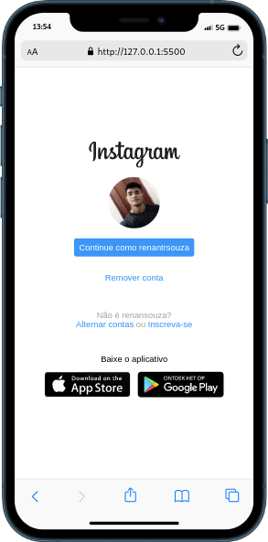
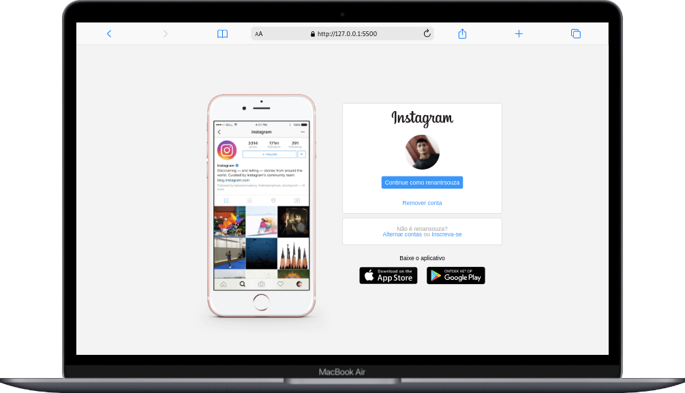

<h1 align="center">Instagram Homepage</h1>
<h4 align="center">Desafio da página inicial do Instagram do bootcamp da Spread - Módulo 2</h4>

  
  
  

    
    
    

## Built with  
- HTML
- CSS

## Contact
- Email me - renantrsouza@gmail.com  
- Connect with me on [LinkedIn](https://www.linkedin.com/in/renantrsouza/)

## License
This project is licensed under the MIT License - see the [LICENSE](https://github.com/:user/:repo/blob/main/LICENSE) file for details.